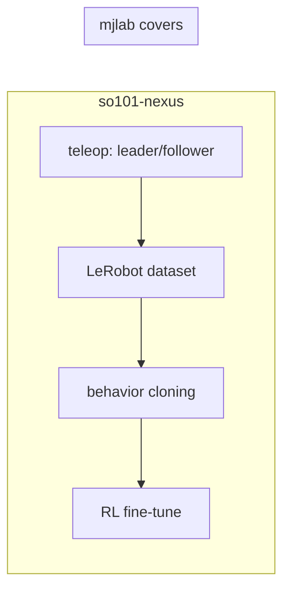

# mjlab as a backend: feasibility assessment

Date: 2026-06-22. Scope: should so101-nexus depend on
[mjlab](https://github.com/mujocolab/mjlab) (Isaac-Lab-style manager API over
MuJoCo Warp) instead of hand-rolling environment stochasticity, rewards,
observations, and configs? Primary concern: keeping CPU environments for teleop.

## TL;DR verdict

- **Do not do a wholesale replacement.** mjlab is not a drop-in for this stack. It
  covers only the "reinforce" third of record -> clone -> reinforce, and even
  there it swaps LeRobot for RSL-RL. It has no teleoperation, no behavior-cloning
  path, no LeRobot dataset recording, and no classic single-instance
  `gymnasium.Env`. Roughly half this codebase (`teleop/`, `lerobot_adapter/`,
  `policy_adapters/`, `processors/`) has no mjlab equivalent.
- **CPU is supported but is not the teleop story you need.** mjlab does run
  CPU-only (it is the macOS eval path), and this repo already runs `mujoco_warp`
  on the Warp CPU device today. The blockers for teleop are not CPU physics: they
  are (a) GPU-first RGB rendering (high-fidelity RGB is an explicit mjlab
  non-goal), (b) an always-vectorized env with no low-latency interactive
  single-env loop, and (c) zero LeRobot integration.
- **The manager-based config migration is feasible and mostly mechanical** for the
  RL side. mjlab even ships a `lift_cube` manipulation task that maps almost
  one-to-one onto `PickLift`. But it forces radians-native configs, raw
  (non-normalized) reward weights, and a model-sharing scene model that does not
  natively express this library's per-world heterogeneous YCB object pools.
- **Recommended path: hybrid.** Adopt mjlab (or just its manager patterns) for the
  Warp/RL training backend, replacing the hand-rolled `so101_nexus/warp/`. Keep
  the classic `so101_nexus/mujoco/` CPU backend for teleop, dataset recording, and
  BC, which mjlab cannot serve. See [Recommendation](#recommendation).

## What mjlab is, and is not

mjlab (v1.4.0, Apache-2.0, ~2.5k stars) pairs Isaac Lab's manager-based MDP API
with MuJoCo Warp for GPU physics. Source of truth used here: the docs at
`mujocolab.github.io/mjlab/main` and `src/mjlab` on `main`.

It **is**:

- A PyTorch-native, **always-vectorized** RL environment framework
  (`ManagerBasedRlEnv`, `is_vector_env = True`; a leading `num_envs` world
  dimension is always present, even at `num_envs=1`).
- A composable MDP: eight managers (Observation, Action, Reward, Termination,
  Event, Command, Curriculum, Metrics) configured as dicts of `*TermCfg` objects
  on a flat `@dataclass(kw_only=True) ManagerBasedRlEnvCfg`.
- A strong **domain-randomization** system (`mjlab.envs.mdp.dr`): typed functions
  for geom/body/joint/site/camera/light/material/tendon fields, pseudo-inertia
  randomization, PD-gain and effort-limit randomization, encoder bias, plus
  push/impulse events. This is materially more capable than the reset-time
  randomization this library does today.
- Tightly bound to MuJoCo: native `MjModel`/`MjData`, MJCF assets, `MjSpec`
  scene composition, MuJoCo Menagerie compatible.
- An RL training stack: `rsl-rl-lib==5.4.0` (PPO), `tyro` CLI, W&B, ONNX export,
  multi-GPU via `torchrunx`.

It **is not**:

- A teleoperation framework. No leader/follower, no human-in-the-loop control.
- A behavior-cloning or imitation-learning framework. No LeRobot integration of
  any kind; datasets/policies are not LeRobot-format.
- A single-instance `gymnasium.Env`. There is no scalar, one-world API.
- A high-fidelity renderer. From the motivation page: "High-fidelity RGB
  rendering is out of scope." RGB exists via `CameraSensor` but is GPU-rendered
  and aimed at privileged-policy-then-distill workflows, not dataset capture.
- Cross-simulator. "Cross-simulator portability is a non-goal."

## What it would be replacing

Current architecture (grounded in the source):

| Concern | so101-nexus today | File(s) |
| --- | --- | --- |
| CPU env (teleop) | `SO101NexusMuJoCoBaseEnv(gymnasium.Env)`, scalar, classic `mujoco`, wrist+overhead cameras via `mujoco.Renderer` | `mujoco/base_env.py` |
| GPU env (RL) | `SO101NexusWarpVectorEnv(VectorEnv)`, batched, `mujoco_warp`, zero-copy `wp.to_torch`, state-only (no cameras) | `warp/base_env.py` |
| Config | hand-rolled HuggingFace-style Python classes, **degrees** public API, validation in `__init__`, dynamic `task_description` | `config.py` (984 lines) |
| Rewards | pure duck-typed functions (float/numpy/torch, no torch import); inlined per task via `_compute_reward` | `rewards.py`, task envs |
| Observations | component system: `Observation(ABC)` + 8 state components + 2 camera components | `observations.py` |
| Stochasticity | reset-time only: `self.np_random` (MuJoCo) / seeded `torch.Generator` (Warp) | base envs |
| Scene/objects | MJCF templates + freejoint object slots; per-world heterogeneous YCB pools | `scene.py`, `object_slots.py`, `objects.py` |
| Teleop | Gradio app, LeRobot `SimSOFollower` robot, `SimCamera`, processor pipelines, dataset recorder | `teleop/`, `lerobot_adapter/`, `processors/` |
| Policies | MolmoAct VLA adapter, chunked policy, recorder | `policy_adapters/` |

Tasks: 5 task types x 2 backends = 10 gym IDs (`MuJoCo*-v1` via `entry_point`,
`Warp*-v1` via `vector_entry_point`): PickLift, PickAndPlace, Touch, LookAt, Move.
Estimated MuJoCo/Warp duplication at the base layer is ~60-70%, with task logic
(scene/objects/rewards/observations) already factored into backend-neutral modules.

## The CPU / teleop concern (the core worry)

**Can mjlab run on CPU? Yes.** Two independent confirmations:

- mjlab FAQ ("Does it work on macOS?"): "mjlab runs on macOS using CPU-only
  execution through MuJoCo Warp." Evaluation works; training is not recommended.
- mjlab FAQ ("How do I run on CPU without touching the GPU?") + issue #949: pass
  `device="cpu"` and all computation runs on CPU. The one caveat #949 documents:
  even with `device="cpu"`, Warp's runtime eagerly claims a CUDA *context* (VRAM)
  on every visible GPU. The reporter first traced it to `seed_rng()` ->
  `wp.rand_init`, but the maintainer confirmed it is deeper (`wp.get_device("cpu")`
  itself starts the full runtime); the attempted fix #950 was reverted in #999
  because it cannot be prevented from Python after import. The reliable workaround
  is the documented one: launch with `CUDA_VISIBLE_DEVICES=""`. This is an
  ergonomic wrinkle (one env var), not a blocker; on a no-NVIDIA / macOS host it
  is moot. `pyproject` exposes a `cpu` extra (CPU torch wheel).

And note this is not even new ground for this repo: `pyproject.toml` already
declares a `warp` extra (`mujoco-warp>=3.9.0.1,<3.10`), the pytest marker `warp`
says tests "run on the Warp CPU device", and `warp/base_env.py` selects
`wp.get_device("cpu" if self.device.type == "cpu" else f"cuda:...")`. **MuJoCo Warp
on CPU is already an exercised path here.**

So CPU physics is not the blocker. The blockers for using mjlab *for teleop* are:

1. **RGB camera rendering.** Teleop records LeRobot datasets with wrist and
   overhead camera frames (`mujoco/base_env.py` `_setup_camera_renderers`,
   `SimCamera`). mjlab's `CameraSensor` "renders RGB and depth images on the GPU";
   high-fidelity RGB is an explicit non-goal. CPU RGB availability/fidelity is
   unproven and not a supported workflow. The current Warp backend already drops
   cameras entirely (`_validate_obs_components` rejects `CameraObservation`), so
   even today the vectorized path cannot record vision datasets. Switching teleop
   to mjlab would inherit this exact limitation.
2. **Always-vectorized, no interactive single-env loop.** Teleop needs a
   real-time, single-instance control loop driven by a human leader at fixed Hz.
   mjlab's env always carries a `num_envs` dimension and is built around CUDA-graph
   batched stepping; on CPU the graph capture is bypassed but the API and data
   layout remain batched. There is no validated low-latency interactive path, and
   you would be squeezing `[1, ...]` tensors through a training-shaped API.
3. **No LeRobot surface.** `SimSOFollower` (LeRobot `Robot`), `SimCamera` (LeRobot
   `Camera`), and the `ProcessorStepRegistry` steps in `processors/` are the entire
   teleop-to-dataset bridge. mjlab has none of this. You would rebuild it against
   mjlab's manager env regardless.
4. **Determinism.** mjlab FAQ: MuJoCo Warp "does not yet guarantee determinism ...
   even when setting a seed" (`mujoco_warp#562`). This conflicts with the
   repo's seeded-reproducibility rule. It is not a regression versus the existing
   Warp path (same `mujoco_warp` underneath), but it would be a regression if it
   replaced the deterministic classic-MuJoCo teleop path. Reset-time *sampling*
   can still be seeded in Python/torch; only the physics rollout is
   non-reproducible.

**Conclusion on CPU/teleop:** CPU is feasible, full stop. #949 is an ergonomic
caveat (`CUDA_VISIBLE_DEVICES=""`), not a feasibility gate, and CPU physics is
already exercised in this repo. The verdict is therefore *not* gated on CPU: it is
teleop-specific. State-only teleop on mjlab CPU would work if you rebuild the
LeRobot bridge. But vision-dataset teleop (wrist + overhead frames for VLA
policies) is blocked by GPU-first rendering, not by CPU. So keep the classic
`gymnasium.Env` + `mujoco.Renderer` backend as the teleop and dataset-recording
path; the blocker that keeps teleop off mjlab is cameras + LeRobot, not the CPU.

## Config migration feasibility

This is the part that ports cleanly. mjlab's migration guide frames it as "mostly
mechanical," and the shipped `src/mjlab/tasks/manipulation/lift_cube_env_cfg.py`
is a near-exact template for `PickLift`: a `JointPositionActionCfg`, a cube entity
plus a `LiftingCommandCfg`, `staged_position_reward` + `bring_object_reward`, an
EE-ground `ContactSensorCfg` termination, fingertip-friction DR via
`dr.geom_friction`, and a per-robot `config/<robot>/` overlay (currently `yam`).
Adding SO-101 is: register the SO101 MJCF as an entity, write a `config/so101`
overlay filling the per-robot placeholders (site names, geom names, action scale,
body name), and wire task terms.

Mapping table (current -> mjlab):

| Current construct | mjlab target | Effort |
| --- | --- | --- |
| `EnvironmentConfig` + subclasses (`PickConfig`, ...) | `ManagerBasedRlEnvCfg` subclass + `SceneCfg` + `SimulationCfg` | Medium; flatten nesting into manager dicts |
| `rewards.py` functions, inlined `_compute_reward` | `dict[str, RewardTermCfg]`, `func=...` term functions returning `[num_envs]` | Low-Medium; logic ports, but torch-only |
| `RewardConfig` budget (weights sum to 1.0, `compute`) | `RewardTermCfg.weight` per term (raw weights), `scale_rewards_by_dt` | Medium; normalization semantics differ |
| `observations.py` components | `dict[str, ObservationGroupCfg]` with `ObservationTermCfg` terms | Low-Medium; 1:1 per component, plus actor/critic groups |
| reset-time `np_random`/`torch.Generator` randomization | `dict[str, EventTermCfg]` (`mode="reset"`/`"startup"`/`"interval"`) + `dr.*` | Low; mjlab is strictly more capable here |
| implicit success-in-info termination | `dict[str, TerminationTermCfg]` (`time_out`, custom) | Low |
| `ControlMode` (3 modes) | action terms: `JointPositionActionCfg` (= `pd_joint_pos`), `RelativeJointPositionActionCfg` (= delta) | Low-Medium; `pd_joint_target_delta_pos` accumulation needs a custom action term |
| dynamic `task_description` on config | no mjlab concept | Custom; carry as `extras`/metadata |
| per-world heterogeneous YCB pools | model shared across worlds; per-world variation via expanded fields | High; see friction below |
| gym registration (`MuJoCo*`/`Warp*`) | mjlab task registry + gym ids | Low |

Frictions that are not just mechanical:

- **Degrees vs radians.** This repo's hard rule is degrees in all public/config
  APIs (`rest_qpos_deg`, `pitch_deg_range`, `MoveConfig` strings). mjlab is
  radians-native (MuJoCo units). A mjlab-style config surface either breaks the
  degrees rule or needs a thin deg->rad config façade in front of every term.
- **Reward budget semantics.** `RewardConfig` enforces a normalized budget
  (reaching+grasping+task+completion = 1.0) with explicit penalties. mjlab uses
  unnormalized per-term `weight`s and multiplies by `dt`. Porting changes the
  reward scale contract; you lose the "budget that sums to one" guarantee unless
  you re-impose it.
- **Per-world object identity.** The Warp backend spawns *distinct* YCB objects
  per world and tracks per-world `task_descriptions` (`warp/pick_env.py`
  `_select_active_slots`, `_set_target_tracking`). mjlab shares one compiled
  `MjModel` across all worlds and varies only *expanded* fields per world
  (mass, friction, pose, color). Heterogeneous object *geometry/identity* per
  world is not a first-class mjlab pattern. You would either compile the full
  object pool into every world and randomize which is active (doable via pose
  parking, as done today) or accept homogeneous-per-batch objects. This is the
  single largest semantic gap in the config migration.
- **Loss of the numpy/scalar reward core.** `rewards.py` is deliberately
  torch-free and duck-typed so the scalar CPU backend can call the same formulas.
  mjlab terms are torch-`[num_envs]` only. Porting rewards into mjlab terms makes
  them torch-only; the shared scalar path (used by the classic MuJoCo backend and
  its tests) would need to keep its own copy or wrap single-env torch.

## The workflow gap (the deciding factor)

The library's thesis is record -> clone -> reinforce. mjlab addresses only
reinforce, and substitutes its own RL stack for LeRobot:

- **record (teleop):** no mjlab support. Stays on classic MuJoCo + LeRobot.
- **clone (BC):** no mjlab support. LeRobot datasets/policies, MolmoAct adapter,
  processor pipelines all live outside mjlab.
- **reinforce (RL):** mjlab is a good fit and arguably an upgrade over the
  hand-rolled Warp backend (managers, DR, RSL-RL, multi-GPU), but its native
  trainer is RSL-RL/PPO, not LeRobot. Feeding mjlab rollouts back into a
  LeRobot-centric pipeline needs an adapter either way.

So "switch to their codebase instead of managing rewards/stochasticity/etc.
myself" only retires the RL-environment third of the stack. It does not simplify
teleop or BC, and it introduces a second, RL-shaped config and training paradigm
alongside the LeRobot one you must keep.

## Dependency and version concerns

mjlab's footprint is large and partly pinned to non-PyPI sources:

- `torch>=2.7.0`, `rsl-rl-lib==5.4.0`, `warp-lang>=1.14` (NVIDIA index),
  `mujoco~=3.8.0` (custom `py.mujoco.org` index), `mujoco-warp` pinned to a
  **git rev** (`e65a72e...`), plus `viser`, `mjviser`, `torchrunx`, `tensordict`,
  `wandb`, `onnxscript`, `mediapy`.
- This repo's base is intentionally light: `numpy`, `mujoco>=3.1.3`,
  `gymnasium>=1.0.0`, `tyro`, `scipy`, `trimesh`, `huggingface_hub`. Top-level
  `import so101_nexus` is required to stay backend-free.
- Conflicts to expect: `mujoco~=3.8` (mjlab) vs `mujoco>=3.1.3` (here);
  `mujoco-warp` git-pin (mjlab) vs `>=3.9.0.1,<3.10` (here); `uv`-only resolution
  with `required-environments` and explicit indexes. Taking mjlab as a hard
  dependency would pull RSL-RL/viser/torchrunx into a project whose other half is
  LeRobot. Confining mjlab to an optional `train`/`warp` extra is the only sane
  packaging.

## Architecture-rule frictions

From `AGENTS.md`:

- "Keep public task semantics consistent across backends." A hybrid where the
  Warp backend is mjlab-manager-based and the MuJoCo backend is monolithic makes
  parity harder to guarantee and must be documented at each point of divergence.
- "One library; backends live under `so101_nexus/<backend>/` ... Top-level import
  stays light." mjlab inside `so101_nexus/warp/` is compatible with this *if* it
  stays import-gated behind the backend module and an extra.
- "Reward functions live in `so101_nexus.rewards`; never inline reward formulas."
  mjlab reward terms are functions registered per task; you can still source the
  math from `rewards.py` (call it inside a `RewardTermCfg.func`), satisfying the
  rule. The doc's "tensor backends may use equivalent inline tensor ops with a
  one-line comment" clause already anticipates this.
- "Tensor-friendly cores ... accept both NumPy arrays and torch tensors." mjlab
  is torch-only; the dual-dtype core survives only on the classic MuJoCo side.

## Recommendation

Adopt mjlab **narrowly, for the Warp/RL backend only**, behind the existing
`warp` extra. Concretely:

1. Keep `so101_nexus/mujoco/` (classic `gymnasium.Env`, CPU, cameras) as the
   teleop, dataset-recording, and BC path. mjlab cannot replace it.
2. Replace the internals of `so101_nexus/warp/` with mjlab manager-based task
   configs, using `lift_cube_env_cfg.py` as the template. Register an SO-101
   entity and a `config/so101` overlay. Reuse `rewards.py` math inside
   `RewardTermCfg.func`s and `object_slots`/`objects` for scene composition.
3. Move reset-time randomization to mjlab `EventTermCfg` + `dr.*`. This is a net
   gain (richer, typed, recomputation-safe DR).
4. Keep the public action contract (`ControlMode`) stable: map `pd_joint_pos` ->
   `JointPositionActionCfg`, delta modes -> `RelativeJointPositionActionCfg`, and
   write a small custom action term for `pd_joint_target_delta_pos` accumulation.
5. Put a deg->rad façade in front of any user-facing config so the degrees rule
   holds.
6. Bridge mjlab rollouts to LeRobot with a thin adapter if RL outputs must feed
   the LeRobot pipeline.

If the dependency weight or the two-config-paradigm cost is unacceptable, the
fallback is to **adopt mjlab's patterns without the dependency**: refactor the
hand-rolled Warp backend into your own manager-style terms (reward/obs/event
dicts) and a richer DR module, keeping degrees, LeRobot, and a light dep tree.
You lose mjlab's maintained DR/manager code but keep full control and one config
style.

Avoid: making mjlab a base dependency, routing teleop through mjlab, or deleting
the classic MuJoCo backend.

## Effort estimate

- Narrow Warp-backend adoption (option 1-6 above): medium. The manipulation
  template, shared scene/object/reward modules, and existing CPU-Warp experience
  do most of the heavy lifting. Main risks: per-world object heterogeneity, the
  custom accumulating-delta action term, and dependency resolution.
- Full replacement of the stack: not advisable. Would require rebuilding teleop,
  BC, LeRobot dataset I/O, camera capture, and policy adapters against mjlab,
  most of which mjlab does not support at all.

## Open questions to resolve before committing

1. Is GPU-only RGB acceptable for RL, given vision datasets/policies (MolmoAct)
   still come from the classic MuJoCo capture path? If RL needs onboard vision,
   mjlab's "privileged-then-distill" stance must be confirmed acceptable.
2. Can per-world heterogeneous YCB pools be expressed via compile-all-park-inactive
   in mjlab without unacceptable `nconmax`/`njmax` cost? Prototype `PickLift`
   first.
3. Is non-deterministic Warp physics acceptable for RL reproducibility here, or do
   experiments need the deterministic classic-MuJoCo path for eval?
4. Does the team accept two config paradigms (LeRobot-side vs mjlab-side), or is
   one-style consistency (the no-dependency fallback) worth reimplementing DR?
5. Dependency strategy: can mjlab be cleanly confined to an extra given its
   git-pinned `mujoco-warp` and custom `mujoco` index versus the current pins?
